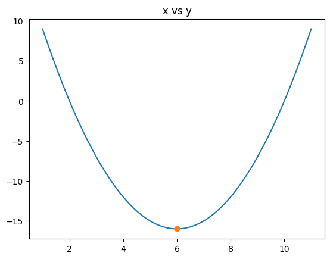

# Jupyter Notebook Collection

This repository contains a collection of Jupyter Notebooks focused on data analysis and visualization using Pandas, SciPy, and Seaborn. Below is a brief overview of each notebook along with visual snapshots.

## 1. Pandas Tutorial

This notebook provides a comprehensive guide on how to use the Pandas library for data manipulation and analysis. It covers:

- DataFrame creation and manipulation
- Data cleaning and preparation
- Data aggregation and group operations
- Handling missing data
- Merging and joining datasets


[Link to Pandas Notebook](pandas.ipynb)

## 2. SciPy Tutorial

This notebook delves into the SciPy library, demonstrating its powerful scientific and technical computing capabilities. Key topics include:

- Optimization techniques
- Sparse data handling



[Link to SciPy Notebook](scipy.ipynb)

## 3. Seaborn Tutorial

This notebook is an in-depth exploration of the Seaborn library, showcasing its capabilities for statistical data visualization. Topics covered:

- Creating various types of plots (e.g., bar plots, line plots, scatter plots)
- Customizing plots with themes and color palettes
- Plotting categorical data
- Visualizing linear relationships
- Pair plots and joint plots


[Link to Seaborn Notebook](seaborn.ipynb)

---

## Requirements
- Python 3.x
- Jupyter Notebook
- Pandas
- SciPy
- Seaborn

## Contributing
Contributions are welcome! Please feel free to submit a Pull Request.

### How to Use

1. Clone the repository:
   ```sh
   git clone https://github.com/shakifahmed/python-libraries.git
